# Foreword
This repo was created for anyone curious as to what is going on with Intel GPUs. There has been a lot of shenanigans with Intel recently regarding their GPUs and I decided to purchase a few. 

In total I have three (SPARKLE Intel Arc A770 TITAN OC Edition 16GB) gpus, one for testing and eventually breaking down in order to help with specs for a water cooling element. The other two are for multi-gpu testing on another desktop.

The GPU referred to in this tutorial is an Intel A770 Sparkle 16 GB.

TODO: rectify directions with the following [link](https://intel.github.io/intel-extension-for-tensorflow/latest/docs/install/install_for_xpu.html)

# A special thanks to
This guide is largely based off of [Christian Mills article](https://christianjmills.com/posts/intel-pytorch-extension-tutorial/native-ubuntu/) on getting the GPU online.

However, there are two catches, of which I will address.

In his tutorial, he guides us through setting up Intel’s PyTorch extension on Ubuntu to train models with their Arc GPUs. The extension provides Intel’s latest feature optimizations and hardware support before they get added to PyTorch. Most importantly for our case, it now includes experimental support for Intel’s Arc GPUs and optimizations to take advantage of their Xe Matrix Extensions (XMX).

The XMX engines are dedicated hardware for performing matrix operations like those in deep-learning workloads. Intel’s PyTorch extension allows us to leverage this hardware with minimal changes to existing PyTorch code.

To illustrate this, we’ll adapt the training code from my beginner-level PyTorch tutorial, where we fine-tune an image classification model from the timm library for hand gesture recognition. By the end of this tutorial, you’ll know all the steps required to set up Ubuntu for training PyTorch models using Arc GPUs.

# Build
## Case
[LINK](https://www.newegg.com/black-jonsbo-mesh-screen-mtx-case-micro-atx/p/2AM-006A-000B8?Item=9SIAY3SJNH9664) JONSBO D31 MESH SC BLACK Micro ATX Computer Case with Sub HD-LCD Display, M-ATX/DTX/ITX Mainboard/Support RTX 4090(335-400mm) GPU 360/280AIO,Power ATX/SFX: 100mm-220mm Multiple Tool-free Design,Black

## Cooling Accessories
### AIO
[LINK](https://www.newegg.com/be-quiet-liquid-cooling-system/p/2YM-0069-00004?Item=9SIA68VBZU7750) be quiet! PURE LOOP 360mm AIO CPU Water Cooler | All In One Water Cooling System | Intel and AMD Support | Low Noise | BW008

[LINK](https://www.newegg.com/icegale-fixed-case-fan/p/1YF-0184-00053?Item=9SIAT5SJH17984) Iceberg Thermal IceGALE Silent 120mm (Black) 3-PACK Quiet Optimized Airflow 3-Pin Case Fans

[LINK](https://www.newegg.com/bgears-vortex-120-case-fan/p/N82E16835132054?Item=N82E16835132054) Bgears Vortex 120 ARGB LED Case Fans b-ARGB Vortex 120

[LINK](https://www.newegg.com/thermal-grizzly/p/13C-003E-00004?Item=9SIA4RE6M28090) Thermal Grizzly Kryonaut Thermal Grease Paste - 1.0 Gram

## CPU
[LINK](https://www.newegg.com/amd-ryzen-9-5900x/p/N82E16819113664?Item=N82E16819113664) AMD Ryzen 9 5900X - Ryzen 9 5000 Series Vermeer (Zen 3) 12-Core 3.7 GHz Socket AM4 105W None Integrated Graphics Desktop Processor - 100-100000061WOF

## GPU
[LINK](https://www.newegg.com/sparkle-arc-a770-sa770t-16goc/p/N82E16814993004?Item=N82E16814993004) SPARKLE Intel Arc A770 TITAN OC Edition, 16GB GDDR6, ThermalSync, TORN Cooling, Axial Fan, Metal Backplate, SA770T-16GOC

## Hard Drive(s)
### Ubuntu Linux
[LINK](https://www.newegg.com/samsung-970-evo-plus-500gb/p/N82E16820147742?Item=N82E16820147742) SAMSUNG 970 EVO PLUS M.2 2280 500GB PCIe Gen 3.0 x4, NVMe 1.3 V-NAND Internal Solid State Drive (SSD) MZ-V7S500B/AM 

### Windows 11 Professional
[LINK](https://www.samsung.com/us/computing/memory-storage/solid-state-drives/990-pro-w-heatsink-pcie-4-0-nvme-ssd-1tb-mz-v9p1t0cw/?cid=pla-ecomm-pfs-mms-us-google-na-03042022-170119-&ds_e=GOOGLE-cr:0-pl:267548417-&ds_c=FF~Memory+PMax_CN~Memory+PMax_ID~B0000PWD_PH~on_MK~us_BS~ms_PR~ecom_SB~memcross_FS~hqloe_CA~smp_KS~nag_MT~na-&ds_ag=-&ds_k=&gad_source=1&gclid=CjwKCAiA1fqrBhA1EiwAMU5m_zGVd5S4llCHabWb0dBGGrnaAD4y-z5oO5w4VcCuGRn1VwT-98lt_RoC5osQAvD_BwE&gclsrc=aw.ds) 990 PRO w/ Heatsink PCIe®4.0 NVMe™ SSD 1TB

## Memory
[LINK](https://www.newegg.com/g-skill-128gb-288-pin-ddr4-sdram/p/N82E16820232992?Item=N82E16820232992) G.SKILL TridentZ RGB Series 128GB (4 x 32GB) 288-Pin PC RAM DDR4 3600 (PC4 28800) Desktop Memory Model F4-3600C18Q-128GTZR

## Motherboard
[LINK](https://www.newegg.com/msi-mag-b550m-mortar-max-wifi/p/N82E16813144636?Item=N82E16813144636) MSI MAG B550M MORTAR MAX WIFI DDR4 AM4 AMD B550 SATA 6Gb/s Micro-ATX Wi-Fi 6E 2.5Gbps LAN M.2 (Key-E) Motherboards - AMD

## Power Supply
[LINK](https://www.newegg.com/deepcool-r-pq850m-fa0b-us-850-w/p/N82E16817328036?Item=N82E16817328036) Deepcool PQ850M R-PQ850M-FA0B-US 850 W ATX12V V2.4 80 PLUS GOLD Certified Full Modular Active PFC Power Supply

# Environment Setup

## Third and fourth display port issue.
Presently only the HDMI and first display port work on my card. This issue is known and as soon as I can find a working fix I will post it here.

## xpu-smi
xpu-smi is currently only functioning for Intel Data Center GPus.

## GPU Monitoring Software
The best gpu monitor app on Linux so far is intel-gpu-tools intel_gpu_top [repo](https://github.com/tiagovignatti/intel-gpu-tools/blob/master/tools/intel_gpu_top.c) [tutorial](http://www.oldcai.com/ai/intel-gpu-tools/)
```bash
sudo apt-get install intel-gpu-tools
```

Use the application:
```bash
sudo intel_gpu_top
```

## other monitoring
The Sparkle editions allow for the passive monitoring of temperature via the RGB color spectrum.

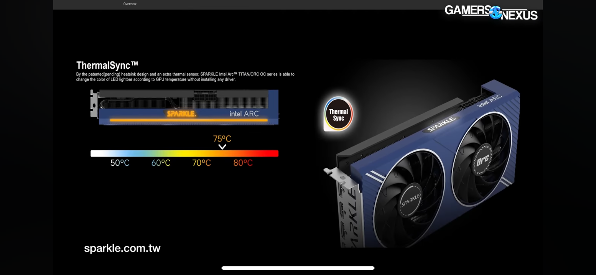

## Resizeable BAR
Each BIOS different, please research how you can check this feature.

Verify:
```bash
lspci -v |grep -A8 VGA
```

Result:
```bash
2d:00.0 VGA compatible controller: Intel Corporation Device 56a0 (rev 08) (prog-if 00 [VGA controller])
	Subsystem: Device 172f:3937
	Flags: bus master, fast devsel, latency 0, IRQ 114, IOMMU group 19
	Memory at fb000000 (64-bit, non-prefetchable) [size=16M]
	Memory at 7800000000 (64-bit, prefetchable) [size=16G]
	Expansion ROM at fc000000 [disabled] [size=2M]
	Capabilities: <access denied>
	Kernel driver in use: i915
	Kernel modules: i915
```

## Operating System:
Intel’s documentation recommends Ubuntu 22.04 LTS or newer. The LTS releases have the minimum required Linux kernel version as of 22.04.3, so we can stick with that. If you already have Ubuntu 22.04 LTS installed, ensure it’s fully updated.

The following is the OS I used.
```bash
cat /etc/os-release
```

```bash
PRETTY_NAME="Ubuntu 22.04.3 LTS"
NAME="Ubuntu"
VERSION_ID="22.04"
VERSION="22.04.3 LTS (Jammy Jellyfish)"
VERSION_CODENAME=jammy
ID=ubuntu
ID_LIKE=debian
HOME_URL="https://www.ubuntu.com/"
SUPPORT_URL="https://help.ubuntu.com/"
BUG_REPORT_URL="https://bugs.launchpad.net/ubuntu/"
PRIVACY_POLICY_URL="https://www.ubuntu.com/legal/terms-and-policies/privacy-policy"
UBUNTU_CODENAME=jammy
```

## Supporting Software
1. Start [here](https://intel.github.io/intel-extension-for-pytorch/index.html#introduction) for the launch point for any updates for Intel® Extension for PyTorch.

2. Navigate to [Installation](https://intel.github.io/intel-extension-for-pytorch/index.html#installation)

3. This tutorial was written for the following GPU installation option, v2.0.120+xpu --> Linux/WSL2 --> pip. Note Intel® Arc™ A-Series GPUs (Experimental support).

### Driver
1. Follow [Client Driver](https://dgpu-docs.intel.com/driver/client/overview.html) Steps 2.1.2 and 2.1.3

### Intel® oneAPI Base Toolkit
1. Follow 2024.0.0 [instructions](https://www.intel.com/content/www/us/en/developer/tools/oneapi/base-toolkit-download.html) Linux online installer.

2. The installer will check system requirements, select Continue.


3. Select "I accept the terms of the license agreement" and Continue.
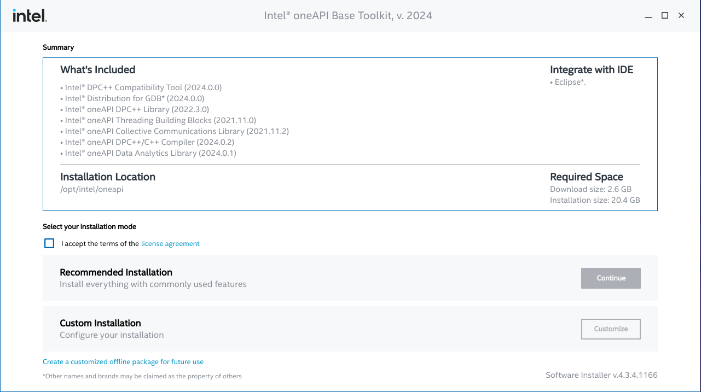

4. Ensure you install libdrm2, I installed it and this warning did not go away, proceed with the next step.
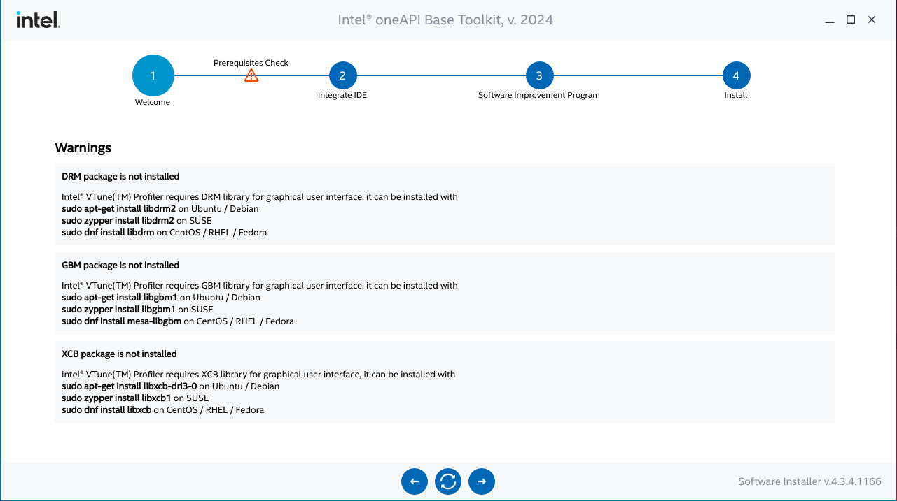

5. Unless you have eclipse installed, I installed Pycharm, proceed with the next step.
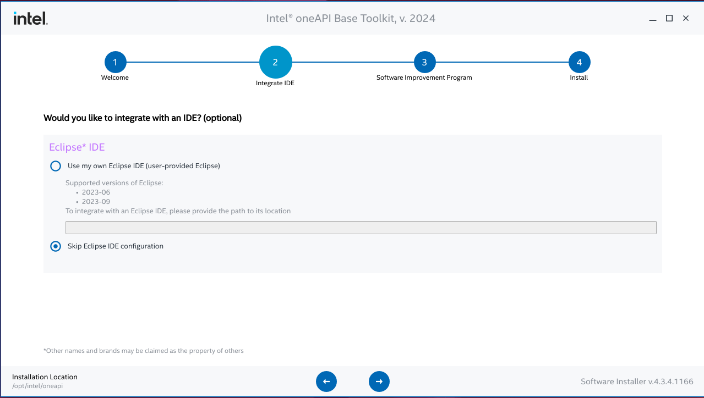

6. I did not consent to the collection of my information, proceed with the next step.
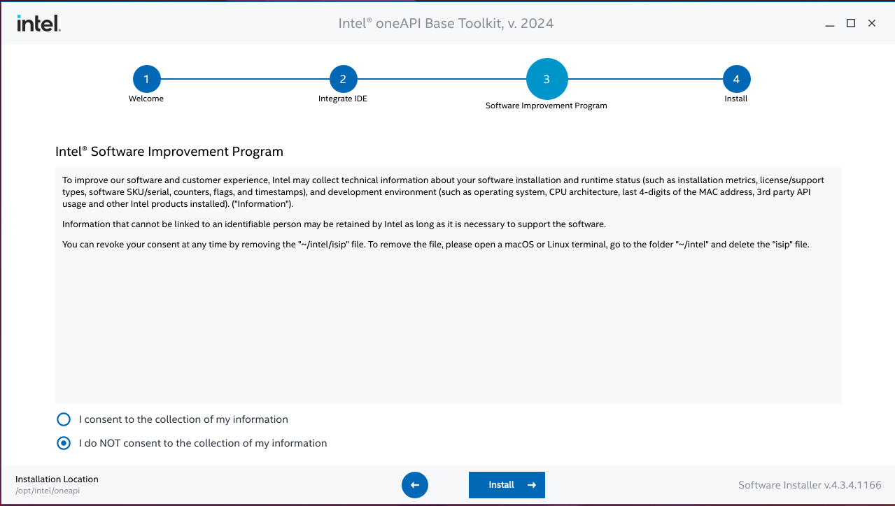

7. With this warning I installed g++, went back one step then proceeded with this warning disappearing.
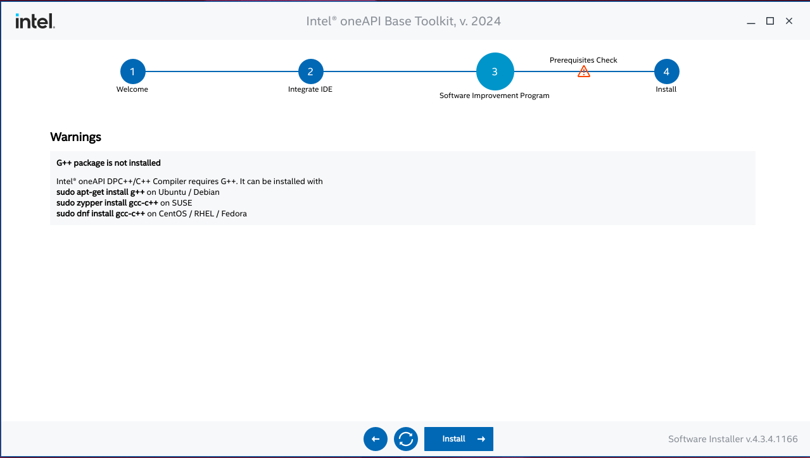

8. Let the install finish then select Finish.
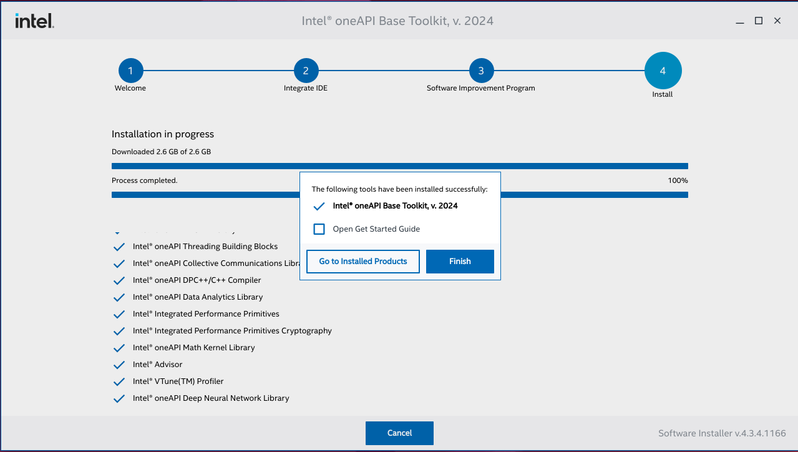

9. Set the environment variables with the following command:
```bash
source /opt/intel/oneapi/setvars.sh
```

Result:

```bash
:: initializing oneAPI environment ...
   bash: BASH_VERSION = 5.1.16(1)-release
   args: Using "$@" for setvars.sh arguments: 
:: advisor -- latest
:: ccl -- latest
:: compiler -- latest
:: dal -- latest
:: debugger -- latest
:: dev-utilities -- latest
:: dnnl -- latest
:: dpcpp-ct -- latest
:: dpl -- latest
:: ipp -- latest
:: ippcp -- latest
:: mkl -- latest
:: mpi -- latest
:: tbb -- latest
:: vtune -- latest
:: oneAPI environment initialized ::
```

10. See the environment variables.
```bash
env | grep oneapi
```

### Mamba

1. We’ll use the Mamba package manager to create the Python environment. You can learn more about it in my getting started tutorial.

The following bash commands will download the latest release, install it, and relaunch the current bash shell to apply the relevant changes:
```bash
wget "https://github.com/conda-forge/miniforge/releases/latest/download/Mambaforge-$(uname)-$(uname -m).sh"
bash Mambaforge-$(uname)-$(uname -m).sh -b
~/mambaforge/bin/mamba init
bash
```

### Intel Extension for Pytorch

1. Create a Python Environment

Next, we’ll create a Python environment and activate it. The current version of the extension supports Python 3.11, so we’ll use that.
```bash
mamba create --name pytorch-arc python=3.10 -y
mamba activate pytorch-arc
```

2. Install the following packages, step 3[a], manually (torch, torchvision and intel_extension_for_pytorch), for some reason pip did not recognize the packages in the instruction set:
```bash
python -m pip install torch==2.0.1a0 torchvision==0.15.2a0 intel-extension-for-pytorch==2.0.120+xpu --extra-index-url https://pytorch-extension.intel.com/release-whl-aitools/
```

3Sanity check, step 4.
```bash
python -c "import torch; import intel_extension_for_pytorch as ipex; print(torch.__version__); print(ipex.__version__); [print(f'[{i}]: {torch.xpu.get_device_properties(i)}') for i in range(torch.xpu.device_count())];"
```

Result (Ignore the warning for libjpeg and libpng unless you want to proceed in a different direction than this tutorial):
```bash
/home/flaniganp/mambaforge/envs/pytorch-arc/lib/python3.10/site-packages/torchvision/io/image.py:13: UserWarning: Failed to load image Python extension: ''If you don't plan on using image functionality from `torchvision.io`, you can ignore this warning. Otherwise, there might be something wrong with your environment. Did you have `libjpeg` or `libpng` installed before building `torchvision` from source?
  warn(
2.0.1a0+cxx11.abi
2.0.120+xpu
[0]: _DeviceProperties(name='Intel(R) Arc(TM) A770 Graphics', platform_name='Intel(R) Level-Zero', dev_type='gpu, support_fp64=0, total_memory=15473MB, max_compute_units=512, gpu_eu_count=512)
```

4Install additional dependencies:

Lastly, we’ll install the other training code dependencies. You can learn about these dependencies ([here](https://christianjmills.com/posts/pytorch-train-image-classifier-timm-hf-tutorial/#installing-additional-libraries)).
```bash
# Install additional dependencies
pip install datasets jupyter matplotlib pandas pillow timm torcheval torchtnt tqdm
# Install utility packages
pip install cjm_pandas_utils cjm_pil_utils cjm_pytorch_utils
```

#### Modification of code in example project.
1. It’s finally time to train a model. The Jupyter Notebooks with the original and modified training code are available on GitHub at the links below.

  * [pytorch-timm-image-classifier-training.ipynb](https://github.com/cj-mills/pytorch-timm-gesture-recognition-tutorial-code/blob/main/notebooks/pytorch-timm-image-classifier-training.ipynb)
  * [intel-arc-pytorch-timm-image-classifier-training.ipynb](https://github.com/cj-mills/pytorch-timm-gesture-recognition-tutorial-code/blob/main/notebooks/intel-arc-pytorch-timm-image-classifier-training.ipynb)

2. Once downloaded, run the following command to launch the Jupyter Notebook Environment:
```bash
jupyter notebook
```

3. We import Intel’s PyTorch extension with the following code:
```bash
import torch
import intel_extension_for_pytorch as ipex

print(f'PyTorch Version: {torch.__version__}')
print(f'Intel PyTorch Extension Version: {ipex.__version__}')
```

```bash
/home/flaniganp/mambaforge/envs/pytorch-arc/lib/python3.11/site-packages/torchvision/io/image.py:13: UserWarning: Failed to load image Python extension: ''If you don't plan on using image functionality from `torchvision.io`, you can ignore this warning. Otherwise, there might be something wrong with your environment. Did you have `libjpeg` or `libpng` installed before building `torchvision` from source?
  warn(

PyTorch Version: 2.0.1a0+cxx11.abi
Intel PyTorch Extension Version: 2.0.110+xpu
```

4. We don’t want to re-import torch after the extension, so we’ll remove that line from the Import PyTorch dependencies section.
```bash
# Import PyTorch dependencies
import torch.nn as nn
from torch.amp import autocast
from torch.cuda.amp import GradScaler
from torchvision import transforms
import torchvision.transforms.functional as TF
from torch.utils.data import Dataset, DataLoader
from torchtnt.utils import get_module_summary
from torcheval.metrics import MulticlassAccuracy
```

5. We can double-check that the extension can use the Arc GPU by getting the properties of the available xpu devices.


6. Next, we’ll manually set the device name to xpu.
```bash
device = 'xpu'
dtype = torch.float32
device, dtype
```

7. Modify the useage of no_amp to None:
```bash
train_loop(model, train_dataloader, valid_dataloader, optimizer, metric, lr_scheduler, device, epochs, None, checkpoint_path)
```

8. Before we run the train_loop function, we’ll use Intel’s PyTorch extension to apply optimizations to the model and optimizer objects. We’ll also cast the model to the bfloat16 data type, so we can train using mixed precision. Intel’s PyTorch extension only supports the bloat16 data type for mixed-precision training currently.

```bash
# Learning rate for the model
lr = 1e-3

# Number of training epochs
epochs = 3 

# AdamW optimizer; includes weight decay for regularization
optimizer = torch.optim.AdamW(model.parameters(), lr=lr, eps=1e-5)

# Optimize the model and optimizer objects
model, optimizer = ipex.optimize(model, optimizer=optimizer, dtype=torch.bfloat16)

# Learning rate scheduler; adjusts the learning rate during training
lr_scheduler = torch.optim.lr_scheduler.OneCycleLR(optimizer, 
                                                   max_lr=lr, 
                                                   total_steps=epochs*len(train_dataloader))

# Performance metric: Multiclass Accuracy
metric = MulticlassAccuracy()

# Check for CUDA-capable GPU availability
use_grad_scaler = torch.cuda.is_available()
```

9. Since we cast the model to bloat16, we must ensure input data use the same type. We can update the inference code using the auto-cast context manager as shown below:
```bash
# Make a prediction with the model
with torch.no_grad():
    with torch.xpu.amp.autocast(enabled=True, dtype=torch.bfloat16, cache_enabled=False):
        pred = model(img_tensor)
```


### Intel Extension for Tensorflow
The following instructions were gleaned from [here](https://intel.github.io/intel-extension-for-tensorflow/latest/docs/install/install_for_xpu.html).

1. Create the environment for tensorflow.
```bash
mamba create --name tensorflow-arc python=3.10 -y
mamba activate tensorflow-arc
```

2. Upgrade pip, Install tensorflow and the intel extension for tenorflow.
```bash
pip install --upgrade pip
pip install tensorflow==2.14.0
pip install --upgrade intel-extension-for-tensorflow[xpu]
````

3. Check environment:
```bash
export path_to_site_packages=`python -c "import site; print(site.getsitepackages()[0])"`
bash ${path_to_site_packages}/intel_extension_for_tensorflow/tools/env_check.sh
``` 

Result:
```bash

    Check Environment for Intel(R) Extension for TensorFlow*...


========================  Check Python  ========================

 python3.10 is installed. 

====================  Check Python Passed  =====================


==========================  Check OS  ==========================

 OS ubuntu:22.04 is Supported. 

======================  Check OS Passed  =======================


======================  Check Tensorflow  ======================

 Tensorflow2.14 is installed. 

==================  Check Tensorflow Passed  ===================


===================  Check Intel GPU Driver  ===================

 Intel(R) graphics runtime intel-level-zero-gpu-1.3.27191.42-775 is installed, but is not recommended . 
 Intel(R) graphics runtime intel-opencl-icd-23.35.27191.42-775 is installed, but is not recommended . 
 Intel(R) graphics runtime level-zero-1.14.0-744 is installed, but is not recommended . 
 Intel(R) graphics runtime libigc1-1.0.15136.24-775 is installed, but is not recommended . 
 Intel(R) graphics runtime libigdfcl1-1.0.15136.24-775 is installed, but is not recommended . 
 Intel(R) graphics runtime libigdgmm12-22.3.12-742 is installed, but is not recommended . 

===============  Check Intel GPU Driver Finshed  ================


=====================  Check Intel oneAPI  =====================

 Intel(R) oneAPI DPC++/C++ Compiler is installed. 
 Intel(R) oneAPI Math Kernel Library is installed. 

=================  Check Intel oneAPI Passed  ==================


==========================  Check Devices Availability  ==========================

2023-12-24 05:07:03.181396: I tensorflow/tsl/cuda/cudart_stub.cc:28] Could not find cuda drivers on your machine, GPU will not be used.
2023-12-24 05:07:03.204525: E tensorflow/compiler/xla/stream_executor/cuda/cuda_dnn.cc:9342] Unable to register cuDNN factory: Attempting to register factory for plugin cuDNN when one has already been registered
2023-12-24 05:07:03.204553: E tensorflow/compiler/xla/stream_executor/cuda/cuda_fft.cc:609] Unable to register cuFFT factory: Attempting to register factory for plugin cuFFT when one has already been registered
2023-12-24 05:07:03.204584: E tensorflow/compiler/xla/stream_executor/cuda/cuda_blas.cc:1518] Unable to register cuBLAS factory: Attempting to register factory for plugin cuBLAS when one has already been registered
2023-12-24 05:07:03.210099: I tensorflow/tsl/cuda/cudart_stub.cc:28] Could not find cuda drivers on your machine, GPU will not be used.
2023-12-24 05:07:03.210366: I tensorflow/core/platform/cpu_feature_guard.cc:182] This TensorFlow binary is optimized to use available CPU instructions in performance-critical operations.
To enable the following instructions: AVX2 FMA, in other operations, rebuild TensorFlow with the appropriate compiler flags.
2023-12-24 05:07:03.715901: W tensorflow/compiler/tf2tensorrt/utils/py_utils.cc:38] TF-TRT Warning: Could not find TensorRT
2023-12-24 05:07:04.274562: I itex/core/wrapper/itex_gpu_wrapper.cc:35] Intel Extension for Tensorflow* GPU backend is loaded.
2023-12-24 05:07:04.310842: I itex/core/wrapper/itex_cpu_wrapper.cc:70] Intel Extension for Tensorflow* AVX2 CPU backend is loaded.
2023-12-24 05:07:04.368781: I itex/core/devices/gpu/itex_gpu_runtime.cc:129] Selected platform: Intel(R) Level-Zero
2023-12-24 05:07:04.369000: I itex/core/devices/gpu/itex_gpu_runtime.cc:154] number of sub-devices is zero, expose root device.

======================  Check Devices Availability Passed  =======================
```

4. Verify the installation.
```bash
python -c "import intel_extension_for_tensorflow as itex; print(itex.__version__)"
```

Result:

```bash
2023-12-24 05:09:06.085702: I tensorflow/tsl/cuda/cudart_stub.cc:28] Could not find cuda drivers on your machine, GPU will not be used.
2023-12-24 05:09:06.107791: E tensorflow/compiler/xla/stream_executor/cuda/cuda_dnn.cc:9342] Unable to register cuDNN factory: Attempting to register factory for plugin cuDNN when one has already been registered
2023-12-24 05:09:06.107812: E tensorflow/compiler/xla/stream_executor/cuda/cuda_fft.cc:609] Unable to register cuFFT factory: Attempting to register factory for plugin cuFFT when one has already been registered
2023-12-24 05:09:06.107841: E tensorflow/compiler/xla/stream_executor/cuda/cuda_blas.cc:1518] Unable to register cuBLAS factory: Attempting to register factory for plugin cuBLAS when one has already been registered
2023-12-24 05:09:06.112918: I tensorflow/tsl/cuda/cudart_stub.cc:28] Could not find cuda drivers on your machine, GPU will not be used.
2023-12-24 05:09:06.113067: I tensorflow/core/platform/cpu_feature_guard.cc:182] This TensorFlow binary is optimized to use available CPU instructions in performance-critical operations.
To enable the following instructions: AVX2 FMA, in other operations, rebuild TensorFlow with the appropriate compiler flags.
2023-12-24 05:09:06.604664: W tensorflow/compiler/tf2tensorrt/utils/py_utils.cc:38] TF-TRT Warning: Could not find TensorRT
2023-12-24 05:09:07.154870: I itex/core/wrapper/itex_gpu_wrapper.cc:35] Intel Extension for Tensorflow* GPU backend is loaded.
2023-12-24 05:09:07.191225: I itex/core/wrapper/itex_cpu_wrapper.cc:70] Intel Extension for Tensorflow* AVX2 CPU backend is loaded.
2023-12-24 05:09:07.248695: I itex/core/devices/gpu/itex_gpu_runtime.cc:129] Selected platform: Intel(R) Level-Zero
2023-12-24 05:09:07.248913: I itex/core/devices/gpu/itex_gpu_runtime.cc:154] number of sub-devices is zero, expose root device.
2.14.0.1
```

5. Then, you can get the information that both CPU and GPU backends are loaded successfully from the console log.

6. Run the example tensorflow script which was taken from Daniel Bourke's Tensorflow class's repo with some changes to print the tensorflow version.
```bash
python code/tensorflow-hello-world.py
```

7. You will need to map the appropriate environment variables in order to trigger the GPU if working with code in a GPU.

8. In Pycharm you can do the following to export the environment variables from oneapi to use for tensorflow:
```bash
printenv | grep oneapi | paste -sd ';' -
```

9. Create a new runtime configuration.

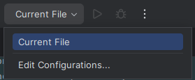

10. Select the "+".

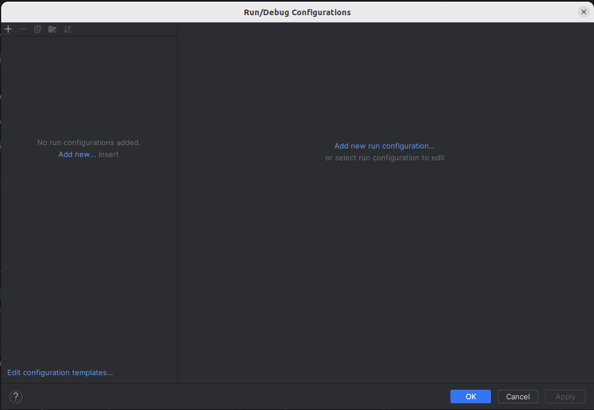

11. Select Python.

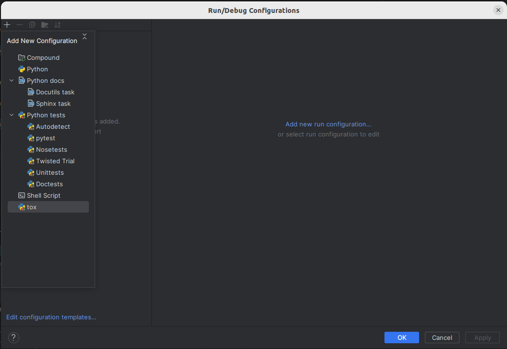

12. Fill in Name, script and place a semicolon after PYTHONBUFFERED=1. After the semicolon place the semicolon delimited env from step 8.

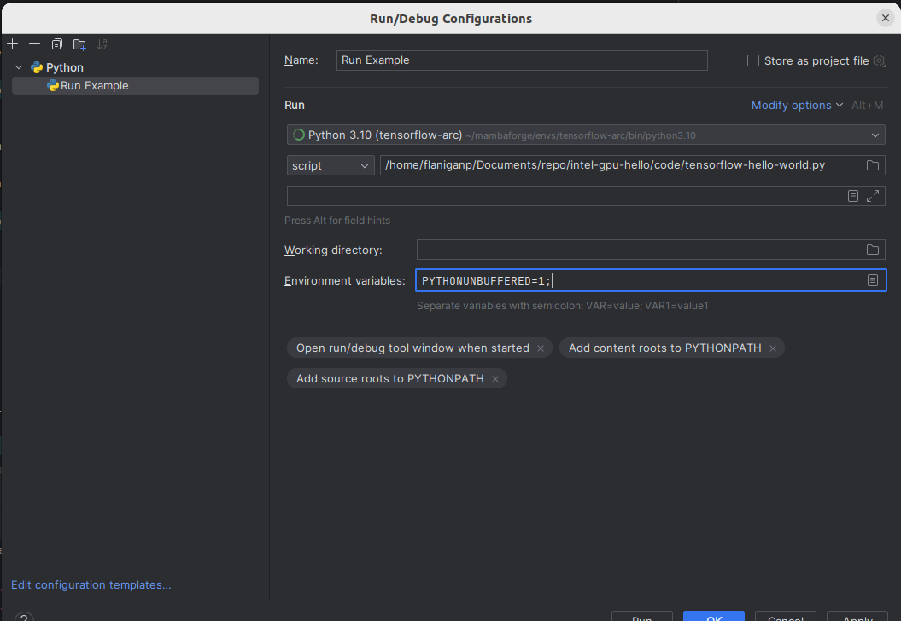

13. When you script runs you will know when the GPU is utilized when the following pops up:
```bash
Intel Extension for Tensorflow* GPU backend is loaded.
```

# Conclusion
In this tutorial, we set up Intel’s PyTorch extension on Ubuntu and trained an image classification model using an Arc GPU. The exact setup steps may change with new versions, so check the documentation for the latest version to see if there are any changes. I’ll try to keep this tutorial updated with any significant changes to the process and to keep in line with the original poster's information.

# Tips
## Intel DKMS
1. If at any time this package, [intel-i915-dkms](https://www.reddit.com/r/linuxquestions/comments/11afpdz/inteli915dkms_nightmare/?rdt=47052), gets in the way of installing or upgrading packages. Get rid of it by.
```bash
sudo apt purge intel-i915-dkms 
```

2. Then remove the package and any other ones not being used.
```bash
sudo apt autoremove
```
