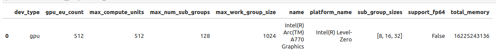

# Foreword
This repo was created for anyone curious as to what is going on with Intel GPUs. There has been a lot of shenanigans with Intel recently regarding their GPUs and I decided to purchase a few. 

In total I have three gpus, one for testing and eventually breaking down in order to help with specs for a water cooling element. The other two are for multi-gpu testing on another desktop.

The GPU referred to in this tutorial is an Intel A770 Sparkle 16 GB.

# A special thanks to
This guide is largely based off of [Christian Mills article](https://christianjmills.com/posts/intel-pytorch-extension-tutorial/native-ubuntu/) on getting the GPU online.

However, there are two catches, of which I will address.

In his tutorial, he guides us through setting up Intel’s PyTorch extension on Ubuntu to train models with their Arc GPUs. The extension provides Intel’s latest feature optimizations and hardware support before they get added to PyTorch. Most importantly for our case, it now includes experimental support for Intel’s Arc GPUs and optimizations to take advantage of their Xe Matrix Extensions (XMX).

The XMX engines are dedicated hardware for performing matrix operations like those in deep-learning workloads. Intel’s PyTorch extension allows us to leverage this hardware with minimal changes to existing PyTorch code.

To illustrate this, we’ll adapt the training code from my beginner-level PyTorch tutorial, where we fine-tune an image classification model from the timm library for hand gesture recognition. By the end of this tutorial, you’ll know all the steps required to set up Ubuntu for training PyTorch models using Arc GPUs.

# Environment Setup

## Third and fourth display port issue.
Presently only the HDMI and first display port work on my card. This issue is known and as soon as I can find a working fix I will post it here.

## xpu-smi
I am currently not able to get this package working with my current setup. Let me know how I can fix this if you can.
```bash
+-----------------------------+--------------------------------------------------------------------+
| Device ID                   | 0                                                                  |
+-----------------------------+--------------------------------------------------------------------+
| GPU Utilization (%)         | N/A                                                                |
| EU Array Active (%)         | N/A                                                                |
| EU Array Stall (%)          | N/A                                                                |
| EU Array Idle (%)           | N/A                                                                |
|                             |                                                                    |
| Compute Engine Util (%)     | N/A                                                                |
| Render Engine Util (%)      | N/A                                                                |
| Media Engine Util (%)       | N/A                                                                |
| Decoder Engine Util (%)     | N/A                                                                |
| Encoder Engine Util (%)     | N/A                                                                |
| Copy Engine Util (%)        | N/A                                                                |
| Media EM Engine Util (%)    | N/A                                                                |
| 3D Engine Util (%)          | N/A                                                                |
+-----------------------------+--------------------------------------------------------------------+
| Reset                       | N/A                                                                |
| Programming Errors          | N/A                                                                |
| Driver Errors               | N/A                                                                |
| Cache Errors Correctable    | N/A                                                                |
| Cache Errors Uncorrectable  | N/A                                                                |
| Mem Errors Correctable      | N/A                                                                |
| Mem Errors Uncorrectable    | N/A                                                                |
+-----------------------------+--------------------------------------------------------------------+
| GPU Power (W)               | 125                                                                |
| GPU Frequency (MHz)         | 2000                                                               |
| Media Engine Freq (MHz)     | N/A                                                                |
| GPU Core Temperature (C)    | N/A                                                                |
| GPU Memory Temperature (C)  | N/A                                                                |
| GPU Memory Read (kB/s)      | N/A                                                                |
| GPU Memory Write (kB/s)     | N/A                                                                |
| GPU Memory Bandwidth (%)    | N/A                                                                |
| GPU Memory Used (MiB)       | 0                                                                  |
| GPU Memory Util (%)         | 0                                                                  |
| Xe Link Throughput (kB/s)   | N/A                                                                |
+-----------------------------+--------------------------------------------------------------------+
```

## Resizeable BAR
Each BIOS different, please research how you can check this feature.

Verify:
```bash
lspci -v |grep -A8 VGA
```

Result:
```bash
2d:00.0 VGA compatible controller: Intel Corporation Device 56a0 (rev 08) (prog-if 00 [VGA controller])
	Subsystem: Device 172f:3937
	Flags: bus master, fast devsel, latency 0, IRQ 114, IOMMU group 19
	Memory at fb000000 (64-bit, non-prefetchable) [size=16M]
	Memory at 7800000000 (64-bit, prefetchable) [size=16G]
	Expansion ROM at fc000000 [disabled] [size=2M]
	Capabilities: <access denied>
	Kernel driver in use: i915
	Kernel modules: i915
```

## Operating System:
Intel’s documentation recommends Ubuntu 22.04 LTS or newer. The LTS releases have the minimum required Linux kernel version as of 22.04.3, so we can stick with that. If you already have Ubuntu 22.04 LTS installed, ensure it’s fully updated.

The following is the OS I used.
```bash
cat /etc/os-release
```

```bash
PRETTY_NAME="Ubuntu 22.04.3 LTS"
NAME="Ubuntu"
VERSION_ID="22.04"
VERSION="22.04.3 LTS (Jammy Jellyfish)"
VERSION_CODENAME=jammy
ID=ubuntu
ID_LIKE=debian
HOME_URL="https://www.ubuntu.com/"
SUPPORT_URL="https://help.ubuntu.com/"
BUG_REPORT_URL="https://bugs.launchpad.net/ubuntu/"
PRIVACY_POLICY_URL="https://www.ubuntu.com/legal/terms-and-policies/privacy-policy"
UBUNTU_CODENAME=jammy
```

## Supporting Software
### Driver
1. Run the following bash commands to add the Intel Graphics drivers repository:
```bash
sudo -v && \
wget -qO - https://repositories.intel.com/graphics/intel-graphics.key | \
  sudo gpg --dearmor --output /usr/share/keyrings/intel-graphics.gpg && \
echo "deb [arch=amd64,i386 signed-by=/usr/share/keyrings/intel-graphics.gpg] https://repositories.intel.com/graphics/ubuntu jammy arc" | \
  sudo tee /etc/apt/sources.list.d/intel-gpu-jammy.list && \
sudo apt-get update
```

2. The above bash commands perform the following steps:

  * Refresh sudo access to avoid multiple password prompts. 
  * Download the Intel graphics repository’s public key. 
  * Convert the downloaded key to binary and save it. 
  * Add the Intel graphics repository to the APT’s list of package sources. 
  * Update the package list from all configured repositories, including the newly added Intel repository

3. Install the following packages:
```bash
sudo apt-get install -y \
  intel-opencl-icd intel-level-zero-gpu level-zero \
  intel-media-va-driver-non-free libmfx1 libmfxgen1 libvpl2 \
  libegl-mesa0 libegl1-mesa libegl1-mesa-dev libgbm1 libgl1-mesa-dev libgl1-mesa-dri \
  libglapi-mesa libgles2-mesa-dev libglx-mesa0 libigdgmm12 libxatracker2 mesa-va-drivers \
  mesa-vdpau-drivers mesa-vulkan-drivers va-driver-all vainfo hwinfo clinfo mesa-utils
```

4. Verify:
```bash
hwinfo --display
```

5. Result:
```bash
28: PCI 2d00.0: 0300 VGA compatible controller (VGA)            
  [Created at pci.386]
  Unique ID: ETRw.nFZoEk2ADRF
  Parent ID: ejHF.mr2N3fBJq5F
  SysFS ID: /devices/pci0000:00/0000:00:03.1/0000:2b:00.0/0000:2c:01.0/0000:2d:00.0
  SysFS BusID: 0000:2d:00.0
  Hardware Class: graphics card
  Model: "Intel VGA compatible controller"
  Vendor: pci 0x8086 "Intel Corporation"
  Device: pci 0x56a0 
  SubVendor: pci 0x172f 
  SubDevice: pci 0x3937 
  Revision: 0x08
  Driver: "i915"
  Driver Modules: "i915"
  Memory Range: 0xfb000000-0xfbffffff (rw,non-prefetchable)
  Memory Range: 0x7800000000-0x7bffffffff (ro,non-prefetchable)
  Memory Range: 0xfc000000-0xfc1fffff (ro,non-prefetchable,disabled)
  IRQ: 114 (270648 events)
  Module Alias: "pci:v00008086d000056A0sv0000172Fsd00003937bc03sc00i00"
  Driver Info #0:
    Driver Status: i915 is active
    Driver Activation Cmd: "modprobe i915"
  Config Status: cfg=new, avail=yes, need=no, active=unknown
  Attached to: #20 (PCI bridge)

Primary display adapter: #28
```

6. Verify media drivers:
```bash
export DISPLAY=:0.0; vainfo
```

7. Result:
```bash
Trying display: wayland
libva info: VA-API version 1.19.0
libva info: Trying to open /usr/lib/x86_64-linux-gnu/dri/iHD_drv_video.so
libva info: Found init function __vaDriverInit_1_19
libva info: va_openDriver() returns 0
vainfo: VA-API version: 1.19 (libva 2.19.0)
vainfo: Driver version: Intel iHD driver for Intel(R) Gen Graphics - 23.3.2 ()
vainfo: Supported profile and entrypoints
      VAProfileNone                   :	VAEntrypointVideoProc
      VAProfileNone                   :	VAEntrypointStats
      VAProfileMPEG2Simple            :	VAEntrypointVLD
      VAProfileMPEG2Main              :	VAEntrypointVLD
      VAProfileH264Main               :	VAEntrypointVLD
      VAProfileH264Main               :	VAEntrypointEncSliceLP
      VAProfileH264High               :	VAEntrypointVLD
      VAProfileH264High               :	VAEntrypointEncSliceLP
      VAProfileJPEGBaseline           :	VAEntrypointVLD
      VAProfileJPEGBaseline           :	VAEntrypointEncPicture
      VAProfileH264ConstrainedBaseline:	VAEntrypointVLD
      VAProfileH264ConstrainedBaseline:	VAEntrypointEncSliceLP
      VAProfileHEVCMain               :	VAEntrypointVLD
      VAProfileHEVCMain               :	VAEntrypointEncSliceLP
      VAProfileHEVCMain10             :	VAEntrypointVLD
      VAProfileHEVCMain10             :	VAEntrypointEncSliceLP
      VAProfileVP9Profile0            :	VAEntrypointVLD
      VAProfileVP9Profile0            :	VAEntrypointEncSliceLP
      VAProfileVP9Profile1            :	VAEntrypointVLD
      VAProfileVP9Profile1            :	VAEntrypointEncSliceLP
      VAProfileVP9Profile2            :	VAEntrypointVLD
      VAProfileVP9Profile2            :	VAEntrypointEncSliceLP
      VAProfileVP9Profile3            :	VAEntrypointVLD
      VAProfileVP9Profile3            :	VAEntrypointEncSliceLP
      VAProfileHEVCMain12             :	VAEntrypointVLD
      VAProfileHEVCMain422_10         :	VAEntrypointVLD
      VAProfileHEVCMain422_10         :	VAEntrypointEncSliceLP
      VAProfileHEVCMain422_12         :	VAEntrypointVLD
      VAProfileHEVCMain444            :	VAEntrypointVLD
      VAProfileHEVCMain444            :	VAEntrypointEncSliceLP
      VAProfileHEVCMain444_10         :	VAEntrypointVLD
      VAProfileHEVCMain444_10         :	VAEntrypointEncSliceLP
      VAProfileHEVCMain444_12         :	VAEntrypointVLD
      VAProfileHEVCSccMain            :	VAEntrypointVLD
      VAProfileHEVCSccMain            :	VAEntrypointEncSliceLP
      VAProfileHEVCSccMain10          :	VAEntrypointVLD
      VAProfileHEVCSccMain10          :	VAEntrypointEncSliceLP
      VAProfileHEVCSccMain444         :	VAEntrypointVLD
      VAProfileHEVCSccMain444         :	VAEntrypointEncSliceLP
      VAProfileAV1Profile0            :	VAEntrypointVLD
      VAProfileAV1Profile0            :	VAEntrypointEncSliceLP
      VAProfileHEVCSccMain444_10      :	VAEntrypointVLD
      VAProfileHEVCSccMain444_10      :	VAEntrypointEncSliceLP
```

8. Verify computing drivers:
```bash
clinfo -l
```

9. Result:
```bash
Platform #0: Intel(R) OpenCL Graphics
 `-- Device #0: Intel(R) Arc(TM) A770 Graphics
```

10. Get the info on that device
```bash
clinfo -d 2:0
```

11. Result (the top 10 lines of a long output):
```bash
  Platform Name                                   Intel(R) OpenCL Graphics
  Device Name                                     Intel(R) Arc(TM) A770 Graphics
  Device Vendor                                   Intel(R) Corporation
  Device Vendor ID                                0x8086
  Device Version                                  OpenCL 3.0 NEO 
  Device UUID                                     8680a056-0800-0000-2d00-000000000000
  Driver UUID                                     32332e33-302e-3236-3931-382e35300000
  Valid Device LUID                               No
  Device LUID                                     805a-c2bbfd7f0000
  Device Node Mask                                0
```

12. Verify 3D drivers installation:
```bash
glxinfo | grep OpenGL
```

13. Result:
```bash
OpenGL vendor string: Intel
OpenGL renderer string: Mesa Intel(R) Arc(tm) A770 Graphics (DG2)
OpenGL core profile version string: 4.6 (Core Profile) Mesa 23.2.0-devel (git-313c40973b)
OpenGL core profile shading language version string: 4.60
OpenGL core profile context flags: (none)
OpenGL core profile profile mask: core profile
OpenGL core profile extensions:
OpenGL version string: 4.6 (Compatibility Profile) Mesa 23.2.0-devel (git-313c40973b)
OpenGL shading language version string: 4.60
OpenGL context flags: (none)
OpenGL profile mask: compatibility profile
OpenGL extensions:
OpenGL ES profile version string: OpenGL ES 3.2 Mesa 23.2.0-devel (git-313c40973b)
OpenGL ES profile shading language version string: OpenGL ES GLSL ES 3.20
OpenGL ES profile extensions:
```

14. Due to issues with oneAPI Base Toolkit the following [fix](https://github.com/intel/intel-extension-for-pytorch/issues/417) has to be made to fix the following error.
```bash
ImportError: libmkl_sycl.so.3: cannot open shared object file: No such file or directory
```

15a. Install basekit 2023.2:
```bash
wget -O- https://apt.repos.intel.com/intel-gpg-keys/GPG-PUB-KEY-INTEL-SW-PRODUCTS.PUB | gpg --dearmor | tee /usr/share/keyrings/oneapi-archive-keyring.gpg > /dev/null
echo "deb [signed-by=/usr/share/keyrings/oneapi-archive-keyring.gpg] https://apt.repos.intel.com/oneapi all main" | tee /etc/apt/sources.list.d/oneAPI.list
apt update
apt install intel-oneapi-runtime-openmp=2023.2.2-47 intel-oneapi-runtime-dpcpp-cpp=2023.2.2-47 intel-oneapi-runtime-mkl=2023.2.0-49495
```

15b. Via an apt list I found that the following is a version back before the breaking 2024 update:
```bash
sudo apt-get install intel-basekit=2023.2.0-49384 -y
```

16. Export the following variables or save them in your .bashrc.
```bash
export ONEAPI_ROOT=/opt/intel/oneapi
export DPCPPROOT=${ONEAPI_ROOT}/compiler/latest
export MKLROOT=${ONEAPI_ROOT}/mkl/latest
export IPEX_XPU_ONEDNN_LAYOUT=1
```

The above lines perform the following steps:

  * Add the installation location for the oneAPI toolkit as an environment variable. 
  * Add the installation location for the DPC++ Compiler as an environment variable. 
  * Add the installation for the Math Kernel Library as an environment variable. 
  * Set the oneDNN memory layout to improve training speed.

17. We’ll use the Mamba package manager to create the Python environment. You can learn more about it in my getting started tutorial.

The following bash commands will download the latest release, install it, and relaunch the current bash shell to apply the relevant changes:
```bash
wget "https://github.com/conda-forge/miniforge/releases/latest/download/Mambaforge-$(uname)-$(uname -m).sh"
bash Mambaforge-$(uname)-$(uname -m).sh -b
~/mambaforge/bin/mamba init
bash
```

18. Create a Python Environment

Next, we’ll create a Python environment and activate it. The current version of the extension supports Python 3.11, so we’ll use that.
```bash
mamba create --name pytorch-arc python=3.11 -y
mamba activate pytorch-arc
```

19. Install the following packages manually (torch, torchvision and intel_extension_for_pytorch), for some reason pip did not recognize the packages in the instruction set:
```bash
pip install https://intel-extension-for-pytorch.s3.amazonaws.com/ipex_stable/xpu/torch-2.0.1a0%2Bcxx11.abi-cp311-cp311-linux_x86_64.whl https://intel-extension-for-pytorch.s3.amazonaws.com/ipex_stable/xpu/torchvision-0.15.2a0%2Bcxx11.abi-cp311-cp311-linux_x86_64.whl https://intel-extension-for-pytorch.s3.amazonaws.com/ipex_stable/xpu/intel_extension_for_pytorch-2.0.110%2Bxpu-cp311-cp311-linux_x86_64.whl
```

20. Install additional dependencies:

Lastly, we’ll install the other training code dependencies. You can learn about these dependencies ([here](https://christianjmills.com/posts/pytorch-train-image-classifier-timm-hf-tutorial/#installing-additional-libraries)).
```bash
# Install additional dependencies
pip install datasets jupyter matplotlib pandas pillow timm torcheval torchtnt tqdm
# Install utility packages
pip install cjm_pandas_utils cjm_pil_utils cjm_pytorch_utils
```

# Modification of code in example project.
1. It’s finally time to train a model. The Jupyter Notebooks with the original and modified training code are available on GitHub at the links below.

  * [pytorch-timm-image-classifier-training.ipynb](https://github.com/cj-mills/pytorch-timm-gesture-recognition-tutorial-code/blob/main/notebooks/pytorch-timm-image-classifier-training.ipynb)
  * [intel-arc-pytorch-timm-image-classifier-training.ipynb](https://github.com/cj-mills/pytorch-timm-gesture-recognition-tutorial-code/blob/main/notebooks/intel-arc-pytorch-timm-image-classifier-training.ipynb)

2. Once downloaded, run the following command to launch the Jupyter Notebook Environment:
```bash
jupyter notebook
```

3. We import Intel’s PyTorch extension with the following code:
```bash
import torch
import intel_extension_for_pytorch as ipex

print(f'PyTorch Version: {torch.__version__}')
print(f'Intel PyTorch Extension Version: {ipex.__version__}')
```

```bash
/home/flaniganp/mambaforge/envs/pytorch-arc/lib/python3.11/site-packages/torchvision/io/image.py:13: UserWarning: Failed to load image Python extension: ''If you don't plan on using image functionality from `torchvision.io`, you can ignore this warning. Otherwise, there might be something wrong with your environment. Did you have `libjpeg` or `libpng` installed before building `torchvision` from source?
  warn(

PyTorch Version: 2.0.1a0+cxx11.abi
Intel PyTorch Extension Version: 2.0.110+xpu
```

4. We don’t want to re-import torch after the extension, so we’ll remove that line from the Import PyTorch dependencies section.
```bash
# Import PyTorch dependencies
import torch.nn as nn
from torch.amp import autocast
from torch.cuda.amp import GradScaler
from torchvision import transforms
import torchvision.transforms.functional as TF
from torch.utils.data import Dataset, DataLoader
from torchtnt.utils import get_module_summary
from torcheval.metrics import MulticlassAccuracy
```

5. We can double-check that the extension can use the Arc GPU by getting the properties of the available xpu devices.


6. Next, we’ll manually set the device name to xpu.
```bash
device = 'xpu'
dtype = torch.float32
device, dtype
```

7. Modify the useage of no_amp to None:
```bash
train_loop(model, train_dataloader, valid_dataloader, optimizer, metric, lr_scheduler, device, epochs, None, checkpoint_path)
```

8. Before we run the train_loop function, we’ll use Intel’s PyTorch extension to apply optimizations to the model and optimizer objects. We’ll also cast the model to the bfloat16 data type, so we can train using mixed precision. Intel’s PyTorch extension only supports the bloat16 data type for mixed-precision training currently.

```bash
# Learning rate for the model
lr = 1e-3

# Number of training epochs
epochs = 3 

# AdamW optimizer; includes weight decay for regularization
optimizer = torch.optim.AdamW(model.parameters(), lr=lr, eps=1e-5)

# Optimize the model and optimizer objects
model, optimizer = ipex.optimize(model, optimizer=optimizer, dtype=torch.bfloat16)

# Learning rate scheduler; adjusts the learning rate during training
lr_scheduler = torch.optim.lr_scheduler.OneCycleLR(optimizer, 
                                                   max_lr=lr, 
                                                   total_steps=epochs*len(train_dataloader))

# Performance metric: Multiclass Accuracy
metric = MulticlassAccuracy()

# Check for CUDA-capable GPU availability
use_grad_scaler = torch.cuda.is_available()
```

9. Since we cast the model to bloat16, we must ensure input data use the same type. We can update the inference code using the auto-cast context manager as shown below:
```bash
# Make a prediction with the model
with torch.no_grad():
    with torch.xpu.amp.autocast(enabled=True, dtype=torch.bfloat16, cache_enabled=False):
        pred = model(img_tensor)
```


# Conclusion
In this tutorial, we set up Intel’s PyTorch extension on Ubuntu and trained an image classification model using an Arc GPU. The exact setup steps may change with new versions, so check the documentation for the latest version to see if there are any changes. I’ll try to keep this tutorial updated with any significant changes to the process and to keep in line with the original poster's information.

# Tips
## Intel DKMS
1. If at any time this package, [intel-i915-dkms](https://www.reddit.com/r/linuxquestions/comments/11afpdz/inteli915dkms_nightmare/?rdt=47052), gets in the way of installing or upgrading packages. Get rid of it by.
```bash
sudo apt purge intel-i915-dkms 
```

2. Then remove the package and any other ones not being used.
```bash
sudo apt autoremove
```